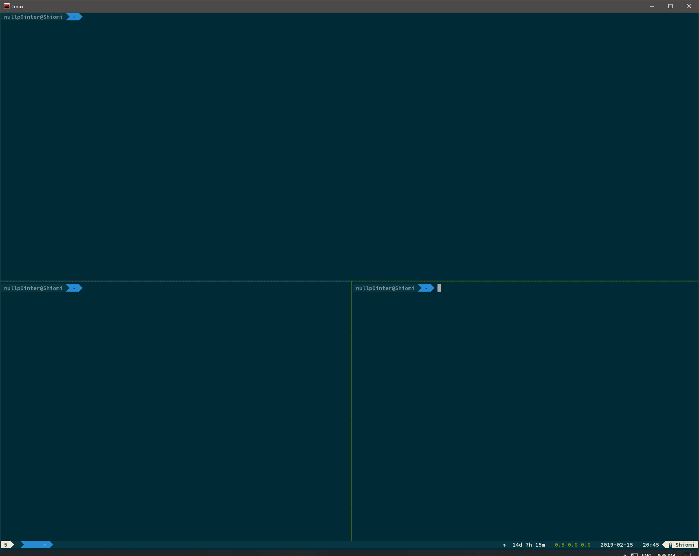

# WSL Setup



This script is designed around quickly altering the bash instance on wsl to
(internally) match my preferences. This all relies upon Windows being properly
set up with an X Server and using the Terminator terminal emulator. The X Server
that I use is VcxSrv (Available on [SourceForge](https://sourceforge.net/projects/vcxsrv/))
which is quick to set up but I would recommend ammending the default firewall
rules it sets up (more on this below).

The script accomplishes the following:  
- Installs gcc
- Installs gcc-multilib
- Installs make
- Installs gdb
- Installs pwndbg on top of gdb
- Installs an ARM Cross compiler
- Installs the Android Debugging Bridge (adb)
- Installs nmap
- Installs python2 and python3
- Installs pip for python2 and python3
- Installs zsh
- Installs Oh-My-Zsh on top of zsh (Changes defualt shell)
- Installs terminator (if not already installed)
- Installs my own dotfiles tested to work "decently" on WSL (see note)
  - Sets up .aliases and .envvars as common places to store them between
    bash and zsh
  - Slight alterations to bashrc and zshrc to ensure launching shell to
    home dirs in WSL
  - Removal of my usual "borderless" terminator (I use it in i3 but it
    breaks your ability to move or resize terms in WSL).
  - Uses agnoster theme in oh-my-zsh, you can change this however you'd
    like.
  - Uses symlinks to the dotfiles git directory. You can manually copy
    them over and replace the originals if you so desire but the installer
    will not do that for you. Sorry.
- Installs vim pathogen
- Attempts to set up powerline for vim and tmux (See notes)


> **Notes**:  
> The setting up of powerline within the installer is a bit wonky and needs
> a bit of work. The default state of this in both vimrc and tmuxrc is OFF
> so that if the process fails then you _shouldn't_ get a bunch of errors
> when launching either program. I actually have this working fairly well
> as part of my [`kali_setup` script](https://github.com/0x8/kali_setup)
> however something isn't implemented here and I have yet to track it down
> just yet.


## A Fix for "pip cannot import main":  
Debian likes to play by their own rules even if they simply don't work. Part
of this includes their botched alteration of /usr/bin/pip such that when you
upgrade via `sudo pip install --upgrade pip` you may break pip to a state that
informs you it cannot import `main`.

This is fixable by using the internal python pip to reinstall pip:  

```
python -m pip install --force-reinstall pip
```


## About setting up VcxSrv and Terminator to work with WSL 

You can find information about getting terminator and VcxSrv up and running at
this [blog post](https://blog.ropnop.com/configuring-a-pretty-and-usable-terminal-emulator-for-wsl/).
By default Windows will ask you to allow traffic to and from VcxSrv to world. 
This is simply not necessary and you can replace the rule(s) (Windows makes two 
by default for me) with allow to/from only from `127.0.0.1`.
